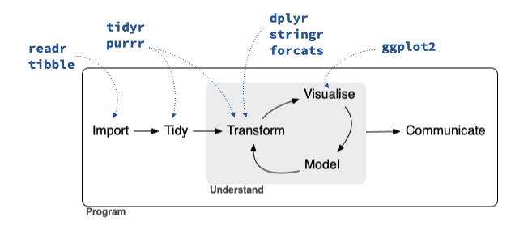
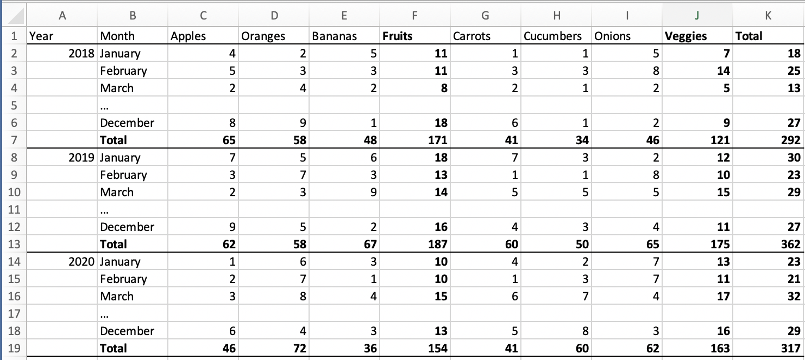

```{r blinding, echo=FALSE}
blind <- FALSE
```

```{r knitr_options, include = FALSE}
knitr::opts_chunk$set(echo = TRUE, eval = TRUE, out.width = "80%", fig.asp = 0.618, fig.align = "center")
#knitr::opts_knit$set(kable.force.latex = TRUE)
library(kableExtra) # I bet we'll need this...
options(knitr.kable.NA = "")

# Some code to add chunk captions
library(knitr)
chunk_hook = knit_hooks$get("chunk")
knit_hooks$set(chunk = function(x, options) {
  x = chunk_hook(x, options)
  if(!is.null(options$codecap))
    x = paste0(x, "\n\\captionof{chunk}{", options$codecap,"}\n")
  if(!is.null(options$ref))
    x = paste0(x, "\n\\label{", options$ref,"}\n")
  
  # Based on https://stackoverflow.com/questions/53887473/how-can-i-control-fontsize-and-linestretch-of-code-chunks-independently-from-the
  code_space = 1
  text_space = 2
  
  paste0(
    "\\linespread{", code_space,"}\n", 
    x,
    "\\linespread{", text_space,"}\n",
    "\\vspace{3mm}\\setlength{\\parindent}{15pt}"
  )
})
```

```{r include = FALSE, eval = TRUE}
library(tidyverse)
ggplot2::theme_set(ggplot2::theme_gray(base_size = 14))
library(infer)
library(openintro)
```

# Introduction

Computing has a fundamental and growing role in the statistics and data science curriculum [@horthard_2021; @nolan_templelang_2010].
The revised Guidelines for Assessment and Instruction in Statistics Education (GAISE) College report notes the importance of technology and states: "ideally, students should be given numerous opportunities to analyze data with the best available technology (preferably, statistical software)" (@CarEve2016, page 11).
In both statistics and data science courses, we believe it is important to teach tools that are used by practitioners of these disciplines (i.e., authentic tools).

When it comes to an authentic tool, @mcna_2019 argues that a modern statistical computing tool "should be accessible, provide easy entry, privilege data as a first-order object, support exploratory and confirmatory analysis, allow for flexible plot creation, support randomization, be interactive, include inherent documentation, support narrative, publishing, and reproducibility, and be flexible to extensions" (page 1). Such tools ideally allow new users and professionals to "reach across the gap" between tools for teaching and tools for doing to foster continued learning [@mcnamara2015].
R exhibits all of these attributes, particularly with careful curation and thoughts toward pedagogy.
It is also flexible, powerful, and open-source.
As a result, many instructors at the undergraduate level, particularly those with a background in statistics, have chosen R [@Rlang] for their teaching.

There are many pedagogical decisions that emerge when an instructor chooses to teach with a particular computational platform or tool.
We describe how the **tidyverse**, a collection of packages intended to provide a consistent interface in R, reduces friction for both the instructor and the student across the entire data analysis cycle, which is foundational to both statistics and data science.
Like many other instructors, we have opted to build much of our teaching around use of the tidyverse.
This paper is a synthesis of the reasoning for our choice, along with benefits and challenges associated with teaching (with) the tidyverse.

We begin with a description of the tidyverse ("what") in Section \ref{sec:principles}, including the design principles that guide its development and promote ease of learning.
Section \ref{sec:tidyverse} follows with examples of "how" the tidyverse works, including comparisons of the tidyverse approach with base R approaches and an outline of core packages and functions. 
Section \ref{sec:teach} articulates "why" one might teach using this approach: namely because it is consistent, scalable, user-centered, readable, and popular.
Section \ref{sec:discussion} provides closing thoughts and discussion.

This paper focuses primarily on undergraduate introductory statistics and data science courses.
However, we will also comment on how gaining an introduction to R and the tidyverse in these courses may help prepare a student for success in higher level courses at the undergraduate and graduate levels, as well as in industry.

There are several popular, free, open-source, programming languages that can be used in introductory statistics and data science, including R [@Rlang], Python [@CS-R9526], and Julia [@mcnicholas2019data]. 
These languages also display many attributes promulgated by @mcna_2019. We note that the influential [Data 8](http://data8.org/) course at the University of California, Berkeley (as well as the follow-up [Data 100](https://ds100.org/sp21/) course) are taught in Python, with a significant portion of the instruction centered around a course-specific Python library. 
We affirm that students benefit from developing literacy in multiple languages and argue that the "tidy data" [@wickham2014tidy] approach central to the tidyverse is programming language independent, with notable implementations in the three languages mentioned above as well as domain specific languages like SQL (see Section \ref{sec:shared-syntax}). We have chosen to focus our attention on R, in part because there are good models for teaching statistics and data science with reproducible computing practices---even at the introductory level [@baumer2014; @beckman2021implementing].

Instructors teaching R face a pedagogical decision about how to teach it.
Some instructors use the "I'll just teach it how I learned it" approach, which we assert is not sound pedagogical reasoning.
Chances are that many things have changed since the time you first learned R.
All the authors have seen major changes to R over their careers, even the most junior among us.
As with the need to keep up with all curricular and pedagogical changes in statistics [@zieffler2008], @nolan_templelang_2010 highlight the importance of workshops or other modes for providing instructors with the skills to teach modern statistical computing.
One of the exciting, albeit challenging, aspects of teaching R (or any computing language or tool) is that the landscape is continuously evolving.
While a changing landscape means instructors need to continue learning, it also means that R has become more user-friendly and student-friendly over time.
Recent developments, perhaps most notably the tidyverse, have helped to round off rough edges and make R interfaces and syntax more coherent and consistent.
It is important for educators to periodically reevaluate their teaching in light of what is most widely used, what is more user-friendly, what has better documentation, what has better learning resources, what has better community support, etc.

Based on all of these considerations (and more that we will articulate below), and despite the need to incorporate additional learning outcomes into our classes, we recommend teaching with the tidyverse as a way to further integrate computation into our courses and programs.
While we recommend the use of the RStudio integrated development environment (IDE; @rstudio), our arguments for the tidyverse also stand outside the RStudio IDE. 
Others have focused on how using R to teach statistics can decrease the cognitive load (amount of information needed at once) of the class [@Pruim2017; @guzman2019successful; @tuckerstatistics2021], which we affirm from our personal teaching experiences.
Here, we focus on the many different pedagogical advantages of using the tidyverse and the specific benefits they bring to the statistics and data science classroom.
Table \ref{tab:summary} summarizes our arguments. 

```{r, echo=FALSE}
tribble(
  ~Concept, ~Description,
  "Consistency", "Syntax, function interfaces, argument names and orders follow patterns", 
  "Mixability", "Ability to use base and other functions within tidyverse syntax", 
  "Scalability", "Unified approach to data wrangling and visualization works for datasets of a wide range of types and sizes",
  "User-centered design", "Function interfaces designed with users in mind", 
  "Readability", "Interfaces that are designed to produce readable code",
  "Community", "Large, active, welcoming community of users and resources", 
  "Transferability", "Data manipulation verbs inherit from SQL's query syntax"
) |>
  knitr::kable(caption = "Summary of pedagogical benefits of the tidyverse discussed in this paper.\\label{tab:summary}", label = "tab:summary") |>
  kableExtra::column_spec(2, width = "28em")
```

# Principles of the tidyverse {#sec:principles}

The tidyverse package is a meta R package that loads eight core packages when invoked, and also bundles numerous other packages upon installation (as suggested dependencies).
These packages all share a design philosophy as well as common grammar and data structures.
The core packages and the phases of the data science cycle they address are shown in Figure \ref{fig:data-science-cycle}.

```{r data-science-cycle, fig.cap = "Data science cycle and the core tidyverse packages that address each phase.", echo = FALSE, fig.align = "center", out.width = "80%"}

```

@tidyverse-style outlines the design principles of the packages in the tidyverse as the following:

-   human-centered design: The tidyverse is designed specifically to support the activities of a human data analyst.
-   consistency: The functions in tidyverse packages are designed with a consistent interface, which allows the user to apply what they learned in one function to another and minimizes the number of special cases one needs to remember.
-   composability: The tidyverse functions allow users to solve complex problems by breaking them down into small pieces, many of which can be combined using the "pipe" operator (or a "+" operator for **ggplot2**). They support iterative exploratory analysis to find the best solution.
-   inclusivity: In addition to the packages and functions themselves, the tidyverse also refers to the community of people who use the packages. The packages, their documentation, and the community support all emphasize inclusivity.

Central to the tidyverse is the notion of tidy data, which @wickham2014tidy defines as "easy to manipulate, model and visualize, and have a specific structure: each variable is a column, each observation is a row, and each type of observational unit is a table" (page 1).

Many of the core packages in the tidyverse were originally developed independently to address specific phases of the data science cycle, and subsequently came together under the tidyverse umbrella in 2016 [@smithdavid2016].
All of the core tidyverse packages are under active development, as the authors iterate to improve functionality.

Many, though not all, of the developers of the tidyverse packages are funded by RStudio, PBC  and work full-time on their open-source development.
The packages are co-developed with community contributors and released under the open source MIT license.
Thus, while development of the tidyverse is funded by RStudio, the packages do not *belong* to RStudio.

## Starting with a (tidy) data frame

In R, data often live in a data frame whose columns represent variables that we want to analyze.
While the simple data frame structure is fundamental to understanding data science and statistics, working with it can be challenging for new learners.

When such a dataset is loaded into R, it is available as an object called a data frame.
When using base R the variables in that data frame are commonly accessed with the `$` operator (e.g., `loans$loan_amount` to access the variable called `loan_amount` in the data frame `loans`).
Often, students are tempted to access the `loan_amount` variable in this example by referring to it simply as `loan_amount` and not specifying the name of the data frame in which it lives.
This results in a frustrating error: `object 'loan_amount' not found`.
Students experience this misconception when they think about variables as stand-alone objects as opposed to components of the data frame in which they live.

One approach to addressing the data frame versus variable challenge in base R is using the `attach()` function, which makes the variables in a data frame available in the global environment.
Copying variables into the global environment is not recommended practice [@google-style] as it can cause name collisions when data frames with identically named variables are attached in the same environment (e.g., if you also had a `car_loans` data frame that also happened to have a variable called `loan_amount` attached).
Additionally, using `attach()` to include a data frame's columns in the global namespace can muddle understanding of connections between the dataset and the variable within it.
Pedagogically, we want students to understand how observations and variables are linked to a structured dataset.

A second approach to working with variables in base R is using the `with()` function, which evaluates an expression within a specified environment (e.g., `with(loans_full_schema, loan_amount)` instead of `loans_full_schema$loan_amount`).
Using `with()` avoids the name collision problem introduced by `attach()` but it is more verbose and requires understanding how a new function works just to access a variable in a data frame.

In the tidyverse, the first argument of each function, whether for data wrangling, visualization, or any of the more complex tasks that can be introduced later, is almost always a data frame.
Tidyverse functions allow access to variables in the data frame without having to re-specify the name of the data frame (e.g., `arrange(loans, loan_amount)` will arrange the rows of the `loans` data frame based on the value of `loan_amount`).
By forcing users to work with tidy data, the tidyverse emphasizes the connection between data frames and variables, helping to underscore fundamental data science and statistics concepts while also simplifying the syntax for routine data analysis tasks.

The tidyverse strongly encourages the use of the pipe operator to construct readable, vertical data pipelines, whether it's for data wrangling or visualization.
Beginning with R 4.1.0, the previous `arrange()` code would be written as `loans |> arrange(loan_amount)` using the pipe operator (`|>`) to pipe the data frame (or any result from the preceding step of the pipeline) into the subsequent function as its first argument (see Section \ref{sec:wrangle} for more details on using the pipe operator in the tidyverse).[^pipe]
Pipe operators exist as a common feature across a number of other programming languages (e.g., the UNIX shell, JavaScript, etc.) and were introduced into the R ecosystem by the **magrittr** package [@R-magrittr] package.
The widespread community adoption of the tidyverse (and the corresponding improved error recovery) led to the introduction of a pipe operator into the base language[^tierney] in early 2021 with R version 4.1.0.

[^pipe]: In versions of R earlier than 4.1.0, the magrittr pipe (`%>%`) must be used in place of the native pipe (`|>`). When using the base R pipe, note that *all* students must be running R version 4.1 or newer).

[^tierney]: See, for example, [Luke Tierney's talk at the 2020 R Core useR! event](https://www.youtube.com/watch?v=X_eDHNVceCU&t=4085s), in which he states that the R Core Team is considering adding a pipe operator to base R because because "magrittr is very popular" and "a number of other languages are adding pipes."

Like the `lm()` function, or systems such as SAS (which feature a common interface with a `DATA =` statement), tidyverse functions take a `data` argument that allows them to localize computations inside the specified data frame.
The tidyverse approach is attractive because it does not muddy the concept of what is in the current environment (always the data as a data frame, never a variable as a vector) while making it easy for variables in a data frame to be accessed without the use of an additional function (like `with()`) or even quotation marks.
Furthermore, unlike `lm()`, functions in the tidyverse almost always take a data frame as their *first* argument and *return* a data frame. 
The consistent structure of data frames and variables makes it easier to get started with data analysis tasks without getting bogged down by language details or using more complicated programming practices.

We note that data frames within the tidyverse are stored as `tibble`s which have class `tbl_df` in addition to `data.frame`.
`tibble`s act similarly to all other `data.frame`s with less transformation of input (e.g., character vectors are not coerced to factors, column names are not modified).
Additionally, when printed, by default only the first ten rows and as many columns as fit into the current console or document are shown, and the rest of the rows and columns are summarized. 
Conversely, when `data.frame`s are printed all rows and columns are shown regardless of how large (width or length-wise) the data are.

## Consistent grammar and vocabulary

@hermans2017writing used the metaphor of programming as writing, and we extend their reasoning to assert that R is a programming language with many syntaxes (or flavors/"dialects").
Different R packages can use different syntaxes for the same idiom.
Even packages included in the distribution of base R do not all have a consistent grammar and vocabulary.
As stated in its design philosophy, the tidyverse strives for consistency across packages [@tidyverse-style].
This makes the tidyverse syntactically different from base R for doing certain tasks, which might lead to learners of the tidyverse being less familiar with base R code, and vice versa.

Tidyverse users tend to use particular vocabulary (e.g., pipes, tibbles, verbs) compared to base R users who are more likely to speak in terms of matrices, dollar signs (`$`), and square brackets (`[]`).
A third commonly used approach is the formula syntax [@Pruim2017], which is characterized by the use of tildes (`~`).
The notion of a "grammar" in R code is well-established for both graphics [@wilkinson2012grammar; @R-ggplot2] and data wrangling [@R-dplyr].
In Section \ref{sec:reading}, we develop notions of pronunciation.
In spoken language, the word 'dialect' refers to a variety of language with distinct vocabulary, grammar, and pronunciation, so we could consider the tidyverse as a dialect among users who read and write R code.

No matter which approach or tool you use, you should strive to be consistent in the classroom whenever possible.
Our choice of the tidyverse offers consistency, something we believe to be of the utmost importance, allowing students to move knowledge about function arguments to their long-term memory [@mcnamaraetal2021a].
From our experience, switching between tools can lead to confusion for students, and switching between syntaxes creates similar difficulties.
Others have highlighted the benefits of using a consistent and well-named syntax [@Pruim2017; @gehrke2021].

One complication of teaching consistently is that Google and StackOverflow can be less useful for students who are taught in only a single modality.
Searching online for answers is an important skill to learn, but because of the variety of extant R syntaxes, searches can lead students to patterns that are unfamiliar.
Students should be explicitly taught *how* to search online and sift through results, emphasizing the fact they are learning a specific syntax and only responses in that syntax will make sense to them.
Better searches will include the names of specific tidyverse packages to each search query.
Being transparent and clear about the use of a syntax will help students situate their knowledge---and misunderstandings---in the broader R ecosystem.

One obvious counter-proposition is that you should teach *all* (or multiple) syntaxes at once.
We strongly disagree.
Trying to teach two (or more!) syntaxes at once will slow the pace of the course, introduce unnecessary syntactic confusion, and make it harder for students to complete their work.
In keeping with the "let them eat cake first" approach [@cetinkaya2020fresh; @wang2017], students benefit from seeing the powerful things that they can do with R first.
Deeper discussions about syntax and under-the-hood programming concepts can occur in subsequent courses after students are already invested in using R.
The approach we recommend is not tidyverse instead of base R, but tidyverse (mostly) before base R. 

We typically espouse a policy of being disciplined in what we teach, liberal in what we accept [@postel1980dod].
In this paradigm, instructors are careful about what they teach but choose an appropriate level of flexibility in the code that students may submit.
One might adopt a policy that any code that works is acceptable.
Another might insist that only tidyverse patterns are acceptable.
To continue the analogy with language, a writing instructor might reasonably accept papers written in any vernacular, or they might insist on a particular writing style for a particular assignment.

# Teaching foundational topics with the tidyverse {#sec:tidyverse}

In this section we provide comparative examples of data wrangling and visualization tasks completed with the two most common R syntaxes: base R and the tidyverse.
The two tasks are essential to introductory data science and introductory statistics courses as well as for data practitioners.
We believe that using the tidyverse makes these tasks more straightforward than other approaches with R.
Our approach is similar to those presented in @kleinman2009sas for comparison of SAS and R syntax; @mcnamaraamelia2021 for comparison of base R, tidyverse, and formula syntaxes in R; and @dierker2021 for comparisons across multiple statistical software programs.

## Data wrangling {#sec:wrangle}

Data wrangling is a major component of data acumen [@nasem2018] that often takes up a majority of the data analysis cycle.
The tidyverse includes a set of common idioms for data wrangling that work in a consistent manner via the **dplyr** and **tidyr** packages.

-   `filter()`: select rows
-   `select()`: select columns
-   `arrange()`: order rows
-   `mutate()`: add new or redefine existing columns
-   `group_by()`: create partitions of rows
-   `summarize()`: aggregate (or "roll up") across rows
-   `*_join()`: merge tables
-   `pivot_*()`: reshape tables

While equivalents for each of these exist in base R and have been used for decades, the base routines were developed independently over time and do not share a common interface.
In contrast, these functions always take a data frame as a first argument, return a data frame, and use a consistent naming convention for arguments.

To highlight some of our arguments, we will use the `loans_full_schema` dataset from the [**openintro**](http://openintrostat.github.io/openintro/index.html) package for code examples [@R-openintro].
The dataset represents thousands of loans made through the Lending Club platform, which allows individuals to lend to other individuals.
The dataset contains information on the applicants and their financial history.
In \ref{loans-data}, a small amount of data wrangling has been done to set the dataset up for analyses throughout the paper.
A fully reproducible version of this paper, including the R code for reproducing all examples, can be found on GitHub at \github{}.

```{r loans, ref = "loans-data", codecap = "The \\texttt{loans} dataset from the openintro package."}
library(tidyverse)
loans <- openintro::loans_full_schema |>
  mutate(
    homeownership = str_to_title(homeownership), 
    bankruptcy = if_else(public_record_bankrupt >= 1, "Yes", "No")
  ) |>
  filter(annual_income >= 10)
```

\ref{loans-data} provides a pipeline for: accessing a data frame within the openintro package, creating two new variables using the `mutate()` function, excluding incomes below \$10, and storing the result in a new tibble called `loans`.

Suppose we want to compute the average income of applicants based on their home ownership status.
In the tidyverse, we could use the following pipeline shown in \ref{tidy-summary}.

```{r tidy-summary, ref = "tidy-summary", codecap = "Using the tidyverse to count applicants and compute the average loan amount from the loans data, sorted by average loan amount."}
loans |>
  group_by(homeownership) |>
  summarize(
    num_applicants = n(),
    avg_loan_amount = mean(loan_amount)
  ) |>
  arrange(desc(avg_loan_amount))
```

The tidyverse syntax expresses the sequential process of the computation.
The pipe operator (`|>`) brings the object from the left of the pipe into the function on the right of the pipe as the first argument; we pronounce the pipe function as "and then." First, we start with the data frame that contains all the data.
And then, we group the data according to the unique values of the `homeownership` variable.
And then, for each unique value of `homeownership`, we compute both the number of rows (calling the result `num_applicants`) and the average loan amount in US Dollars (`avg_loan_amount`).
And then, we arrange the rows of the resulting data frame in `desc`ending order according to the value of `avg_loan_amount`.

In base R, we might perform the same task with a computation similar to the one in \ref{base-summary}.

```{r base-summary, ref = "base-summary", codecap = "Using base R to count applicants and compute the average loan amount from the loans data, sorted by average loan amount."}
res1 <- aggregate(loan_amount ~ homeownership, data = loans, FUN = length)
names(res1)[2] <- "num_applicants"
res2 <- aggregate(loan_amount ~ homeownership, data = loans, FUN = mean)
names(res2)[2] <- "avg_loan_amount"
res <- merge(res1, res2)
res[order(res$avg_loan_amount, decreasing = TRUE), ]
```

We find the base R code harder to read and less expressive of the logical process of the computation (i.e., more *cryptic*).
It requires storing intermediate objects (`res1`, `res2`, and `res`) that might not otherwise be useful.
It uses the `~`, `$`, and `[` operators.
It uses a magic number (`2`) to hard-code the second variable.
It creates two data frames that need to be merged together.
It passes the name of a function as an argument to a function.
In Section \ref{sec:scalability}, we argue that the base R syntax for the task at hand does not scale well for additional summary statistics.
And in light of Section \ref{sec:reading}, the base R syntax is quite challenging to read aloud.

A different base R pattern, shown in \ref{tapply-summary}, is more compact, and avoids some of the pitfalls listed above, but returns a vector.
This named vector makes the result easy to read.
However, it makes it cumbersome to include the second variable indicating the number of people.

```{r tapply-summary, ref = "tapply-summary", codecap = "Using \\texttt{tapply()} within base R to count applicants and compute the average loan amount from the loans data, sorted by average loan amount."}
sort(tapply(loans$loan_amount, loans$homeownership, mean), decreasing = TRUE)
```

Piping can simplify the code, as seen in \ref{tapply-tidy-pipe} (equivalent results with the native pipe not shown).

```{r tapply-tidy-pipe, ref = "tapply-tidy-pipe", codecap = "Using the pipe and \\texttt{tapply()} to count applicants and compute the average loan amount from the loans data, sorted by average loan amount.", eval = FALSE}
tapply(loans$loan_amount, loans$homeownership, mean) |>
  sort(decreasing = TRUE)
```

## Data visualization

The process of teaching and learning data visualization is challenging [@nolaperr_2016].
Students are asked to engage with multiple interrelated steps: (1) the conceptualization and design of the visualization, (2) the translation of the design into the specific syntax of the plotting tool or library, and (3) the cleaning, conversion, and transformation of the data that will be represented in the visualization.
It is for the latter two tasks we believe the tidyverse substantially improves on base R's functionality, particularly when it comes to new learners.

Base R plotting is very powerful and flexible, but that flexibility leads to idiosyncratic behavior and confusion.
Take, for example, the creation of a basic scatterplot of the variables `x` and `y` stored in a data frame `d`. 
All of the following would produce the same plot: `plot(d)`, `plot(y~x, d)`, `plot(d$x, d$y)`, `with(d, plot(x,y))`, and so on.
This flexibility, made possible by the S3 object system, is useful but can be overwhelming for new learners.
The difficulty is particularly apparent when students get stuck and search for terms like "scatterplot in R" and come across solutions which use an approach that differs substantially from their instructor's preferred method (e.g., using the formula method when they have only been shown `$` for column access).

The issue of student confusion caused by idiosyncratic behavior gets worse as needs expand beyond the most basic plotting primitives.
Students can easily *use* custom plotting methods (e.g., `density(x)`), functions for more specific plotting primitives (e.g., `boxplot(y~x)`), and methods combining both (e.g., `hist(x)`) without building a higher-level understanding of how to create a complex plot.
That is, while all the plotting tools are usable, it is hard for students to develop a mental model of their commonalities without first having a deeper understanding of R as a programming language, specifically around generic functions, basic data structures, and classes.

As mentioned previously, most of base R's plotting functionality is built around S3 specializations of `plot()` and similar high-level plotting functions.
In some cases, the plot types are relatively easy to identify by name (e.g., `hist()`, `barplot()`, `boxplot()`) while others are less obvious (e.g., `abline()`, `image()`, or `par()`).
The base R plotting functions are part of the **graphics** package, which is loaded automatically by all R sessions.

To visualize using tidyverse principles, we use one of the core tidyverse packages: ggplot2.
In ggplot2, different plot types are implemented using geometry functions (prefixed with `geom_`) which map variables in the data to various aesthetic properties (e.g., horizontal and vertical position, size, color, etc.) of the plots.
One of the immediate advantages of using `geom_*()` functions for plotting is the reduction in the search space of possible plotting functions.
The prefix works effectively to organize the search space to the possible functions and their associated documentation.
The narrowing is true whether within an IDE (using tab-completion), in the documentation (looking just in the `g` section), or searching online.
In contrast, standard base graphics begin with a multitude of different characters, so there is no obvious way to simply see all the possibilities.

Additionally, the geometries implemented in ggplot2 use the same core function arguments and share common aesthetics, which makes it easier to pick up and explore new geometries, as well as quickly swap between related visualization methods.
For example, changing between boxplots and violin plots (an augmented form of boxplots) only requires changing `geom_boxplot()` to `geom_violin()`---the arguments to the two functions remain the same.

As ggplot2 is built around the principles of the grammar of graphics [@wilkinson2012grammar], its syntax is designed to reflect the process of building a visualization through the composition of layers using the `+` operator.
In contrast, base R graphics are generally built up using multiple function calls (e.g., `plot(..., add=TRUE)` and `abline()`).

\ref{ggplot-exref} presents an example of side-by-side boxplots of `loan_amount` as a function of `application_type` and `homeownership`.

```{r ggplot_ex, ref = "ggplot-exref", codecap = "Using ggplot2 to create boxplots of \\texttt{loan\\_amount} broken down by both \\texttt{application\\_type} and \\texttt{homeownership}.", out.width = "100%", fig.asp = 0.35, fig.width = 9}
loans |>
  ggplot(aes(y = loan_amount, x = application_type)) +
  geom_boxplot() +
  facet_wrap(~ homeownership)
```

The figure is constructed in three calls: one to bind the data and map the variables to aesthetics, another to draw the boxplot, and the last to facet by levels of `homeownership`.
A similar plot can be constructed using base R graphics (see \ref{base-plot-ex}), however the process of creating facets is more burdensome as it requires using creation of separate plots with a `for()` loop and subsetting to iterate over the unique levels of `homeownership`.

```{r base_plot_ex, ref = "base-plot-ex", codecap = "Using base R to create boxplots of \\texttt{loan\\_amount} broken down by both \\texttt{application\\_type} and \\texttt{homeownership}.", out.width = "100%", fig.asp = 0.35, fig.width = 9}
levels <- sort(unique(loans$homeownership))
n <- length(levels)

par(mfrow = c(1,n))
for(i in seq_len(n)) {
  boxplot(
    loan_amount ~ application_type, 
    data = loans[loans$homeownership == levels[i],],
    main = levels[i]
  )
}
```

As seen in \ref{ggplot-ex2}, in ggplot2 it is straightforward to extend the original boxplot to more data dimensions by mapping another variable to an additional aesthetic.
For example, adding `fill = bankruptcy` to the `aes()` call will create a plot that now displays four dimensions of the original data.

```{r ggplot_ex2, ref = "ggplot-ex2", codecap = "Using ggplot2 to create boxplots of \\texttt{loan\\_amount} broken down by both \\texttt{application\\_type} and \\texttt{homeownership}, filled by \\texttt{bankruptcy}.", out.width = "100%", fig.asp = 0.35, fig.width = 9}
loans |>
  ggplot(aes(y = loan_amount, x = application_type, fill = bankruptcy)) +
  geom_boxplot() +
  facet_wrap(~ homeownership)
```

Splitting the data to create multiple boxplots based on different variables is possible with base R, however the implementation is more complex and verbose, and it is left as an exercise to the reader.

Next we generate scatterplots of interest rate as a function of income, where the points and linear fits are colored by the bankruptcy status of the loan recipient.

```{r ggplot-scat, ref = "ggplot-scat", codecap = "Using ggplot2 to create a scatterplot of \\texttt{interest\\_rate} versus annual income, colored by \\texttt{bankruptcy}.", out.width = "80%", message = FALSE, fig.asp = 0.618, fig.width = 8}
loans |>
  ggplot(aes(y = interest_rate, x = annual_income, color = bankruptcy)) +
  geom_point(alpha = 0.1) + 
  geom_smooth(method = "lm", size = 2, se = FALSE) + 
  scale_x_log10(labels = scales::label_dollar()) +
  scale_y_continuous(labels = scales::label_percent(scale = 1)) +
  scale_color_manual(values = c("#E69F00", "#56B4E9")) +
  labs(
    x = "Annual Income", 
    y = "Interest Rate", 
    color = "Previous\nBankruptcy"
    )
```

We note that \ref{ggplot-scat} requires seven function calls, but each call builds on a common framework and interface.

```{r include=FALSE}
prev = options()
options(scipen = 5)
```

Base R code is used in \ref{base-scat} to create a similar scatterplot, but the syntax requires careful study of the documentation for `par()` and multiple separate calls of `lm()`.

```{r base-scat, ref = "base-scat", codecap = "Using base R to create a scatterplot of \\texttt{interest\\_rate} versus annual income, colored by \\texttt{bankruptcy}.", out.width = "80%", fig.asp = 0.618, fig.width = 8}
cols = c(No = "#E69F00", Yes = "#56B4E9")

plot(
  loans$annual_income,
  loans$interest_rate,
  pch = 16,
  col = adjustcolor(cols[loans$bankruptcy], alpha.f = 0.1),
  log = "x",
  xlab = "Annual Income ($)",
  ylab = "Interest Rate (%)",
  xaxp = c(1000, 10000000, 1)
)

lm_b_no = lm(
  interest_rate ~ log10(annual_income), 
  data = loans[loans$bankruptcy == "No",]
)
lm_b_yes = lm(
  interest_rate ~ log10(annual_income), 
  data = loans[loans$bankruptcy == "Yes",]
)

abline(lm_b_no, col = cols["No"], lwd = 3)
abline(lm_b_yes, col = cols["Yes"], lwd = 3)

legend(
  "topright", 
  legend = c("Yes", "No"), 
  title = "Previous\nBankruptcy", 
  col = cols[c("Yes", "No")], 
  pch = 16, lwd = 1
)
```

```{r include=FALSE}
options(prev)
```

We note several differences between the two scatterplot implementations.
The ggplot2 approach uses function arguments vs. base graphics parameters.
Some of the parameters (e.g., `xaxp`, `log`) are idiosyncratic and difficult to find in the documentation.
Specifying colors and alpha transparency levels are quite different in the two implementations.
In base graphics, legends require a separate function with additional manual bookkeeping, which increases the potential for human error.
Explicit iteration is required to create multivariate plots and the user is required to specify the display structure.
Care is needed in constructing axis values.

We note that the `+` operator in the ggplot2 syntax differs from the pipe (`|>`) operator for historical reasons [@wickham2015pipe].
We have found, however, that the `+` operator is straightforward for students to learn.
The `+` operator is consistent with the layering aspect of creating a plot.
Additionally, the error message when `|>` is used in place of `+` explicitly asks: `Did you use %>% instead of +?`.[^pipe-error]

[^pipe-error]: As of this writing, the ggplot2 error message still references the magrittr pipe (`%>%`), even when you use the native pipe (`|>`). 

## Beyond wrangling, statistical summaries, and visualizations {#sec:extra}

While data wrangling and data visualization are high on the list of important tasks for working with data, there are many additional tasks and tools needed for a complete data analysis.
We argue that setting your students up to understand the tidyverse approach will not only help them work fluently with data at the exploratory data analysis stage, but will also provide a solid grounding for inference, modeling, working with databases (e.g., SQL), and other data-focused operations.

**Statistical inference** can be taught using the **infer** package [@R-infer], which uses a consistent syntax for one- and two-sample inferential techniques for tidy data.
The package implements both computational methods like randomization tests and bootstrapping as well as mathematical models like t- and z-tests.
With the infer syntax, students learn a single set of functions that walk through the inferential process and focus attention on each step of the process.
Indeed, the functions themselves are named to reinforce the conceptual understanding of the process.
For example, a student will `specify()` the variables *and then* `hypothesize()` about the conditions *and then* `generate()` a sampling distribution *and then* `calculate()` the statistic of interest.
The output of these functions can be wrangled (e.g., to determine a p-value) or visualized (e.g., to inspect the null sampling distribution).

When doing **modeling and machine learning**, many data analysts rely on functions like `lm()` and `glm()` as important tools in the analysis process.
To avoid reinventing the wheel, packages like **broom** [@R-broom] allow **tidy modeling with base R functions** to extend the convention of data frame as input and data frame as output for modeling tasks.
Using `lm()` as an example, there are model output pieces that: 1) describe each of the variables (e.g., the coefficients); 2) describe each of the observational units (e.g., the residuals); and 3) describe the entire model (e.g., $R^2$).
Since the `lm()` output is a list with a specialized print method, it is not immediately clear how to access certain components of it (e.g., the value of the slope or the intercept) programatically.
The broom paradigm---which can be applied to `lm()` and `glm()` as well as many other model objects---uses `tidy()` for output which describes variables, `augment()` to describe observational units, and `glance()` to describe the entire model.
The outputs of each of these functions is a tibble, which makes it easy to extract values like coefficient estimates or p-values using data wrangling functions offered by dplyr.
This, in turn, makes it straightforward to include these extracted values within text in computational documents (e.g., R Markdown documents) using inline code chunks, hence easing reproducible communication of results.

In addition to modeling done using base R functions, a educator or student interested in machine learning methods or approaches (e.g., cross validation) may benefit from **tidy modeling functionality** available in the **tidymodels** package [@R-tidymodels].
The core idea of tidymodels is to simplify the practice of modeling by pre-processing *and then* training *and then* validating models.
The pre-processing step can scale variables or filter for highly correlated covariates.
The training step can use anything from a linear model to a support vector machine to a neural network.
The validating step incorporates cross validation or prediction on a test dataset to evaluate the user's metric of choice.

**Database technologies** are supported using the dplyr [@R-dplyr] and **dbplyr** [@R-dbplyr] packages, which facilitate access to SQL databases using the same general syntax and idioms learned with the tidyverse.
As an example, we can access and summarize data from a publicly accessible repository of audiological measurements [@voss_2019] using the same form as our earlier wrangling (see Section \ref{sec:wrangle}).

```{r SQL_ex, ref = "SQL-ex", codecap = "Applying tidyverse wrangling to data which has been queried from a SQL database."}
db <- DBI::dbConnect(
  RMySQL::MySQL(),
  dbname = "wai", 
  host = "scidb.smith.edu", 
  username = "waiuser", 
  password = "smith_waiDB"  # publicly accessible database
)

db |>
  tbl("Subjects") |> 
  group_by(AgeCategoryFirstMeasurement) |>
  summarize(num_people = n())
```

Note that the output of the wrangled SQL data is a `tibble` similar to that of Section \ref{sec:wrangle}, but with additional information about the MySQL database server.

# Pedagogical strengths of the tidyverse {#sec:teach}

In this section, we expand on the core benefit of the tidyverse outlined in Section \ref{sec:tidyverse}, consistency, by highlighting pedagogical strengths with respect to mixability, scalability, user-centered design, readability, community, and shared syntax.

## Mixability {#sec:mixability}

Consistent syntax and interface are hallmarks of the tidyverse's design principles (as outlined in Section \ref{sec:principles}).
As instructors, we strive for consistency in how we use the tidyverse in our teaching.
To achieve this, we avoid mixing-and-matching tidyverse patterns with base R patterns.
An example of inconsistent behavior to avoid is using base graphics for boxplots and ggplot2 for scatterplots or using `dplyr::count()` for creating a frequency table for two categorical variables but then using a function from the `apply()` family for creating summaries for a numerical variable across levels of a categorical variable.
However, it's not possible to write "tidyverse code" without using base R functions and this mixability is a strength of the tidyverse, allowing students to learn many base R functions (e.g., `mean()`, `sd()`, `quantile()`, `dnorm()`) while learning the tidyverse framework.
Additionally, because the input and output of tidyverse functions are "normal" R objects (typically, a data frame), an instructor can be consistent without coding exclusively in the tidyverse.

In Section \ref{sec:extra} we illustrate how the infer package can be used in an introductory statistics course to extend the tidyverse framework to include statistical inference.
However, one can certainly teach introductory statistics by combining functionality from the most popular tidyverse functionality (i.e., dplyr and ggplot2) for wrangling with base R implementations of inferential functions (e.g., `t.test()`, `chisq.test()`, etc.).
The combination of functions will necessitate some inconsistency, since some base R inferential functions accept vectors as inputs rather than data frames.
However, as with explaining the difference between the `+` and `|>`, instructors can explain that data wrangling and visualization always use data frames, but that inferential functions sometimes use vectors.
We believe that inference is smoother with the infer package, but a decision not to adopt infer should not preclude an instructor from adopting the tidyverse for other tasks.

A similar argument holds for statistical modeling, where `lm()` can be used alongside tidyverse code.
We contend that broom and/or tidymodels reduce friction when analyzing data that can arise due to inconsistent input and output types of base R's modeling functions, but several of the authors still teach `lm()` in their own courses.

## Scalability {#sec:scalability}

In Section \ref{sec:wrangle}, we illustrated how the `group_by()` and `summarize()` verbs make it easy to "roll up" a data frame by groups.
Next, we consider extending that analysis in two different ways: by adding one or more summary computations; and by adding one or more additional grouping variables.
In both cases, we argue that tidyverse code adapts more easily than base R by not requiring a student to learn any additional functions.

First, in Example \ref{tidy-summary-again}, we note that adding an aggregate computation involves only a comma and the expression involving the relevant summary function in the call to `summarize()`.
Here, we compute two quantities: a count (`num_applicants`) and a mean (`avg_loan_amount`).

```{r tidy-summary-again, ref = "tidy-summary-again", codecap = "Using the tidyverse to count applicants and compute the average loan amount from the loans data, sorted by average loan amount."}
loans |>
  group_by(homeownership) |>
  summarize(
    num_applicants = n(),
    avg_loan_amount = mean(loan_amount)
  ) |>
  arrange(desc(avg_loan_amount))
```

If we wanted to compute $p$ quantities, for any integer $p > 1$, it is straightforward to add $p$ arguments to `summarize()`.
Thus, this type of operation is *scalable*, because the number of lines of code is proportional to the number of quantities computed.

Additionally, if the variables to be summarized can be selected based on their types or names, we can use `dplyr::across()` to summarize many variables with one line of code.
In example \ref{across}, we show how to calculate the mean for across variables in the `loans` dataset that contain the character string `"paid"` for each `homeownership` group.

```{r across, ref = "across", codecap = "Using the tidyverse to calculate mean amounts across variables that contain the character string 'paid' for each homeownership group."}
loans |> 
  group_by(homeownership) |> 
  summarise(across(contains("paid"), mean))
```

Achieving scalability in base R is possible, but the approaches involve additional programming concepts.
<!--
https://r.789695.n4.nabble.com/Any-way-to-apply-TWO-functions-with-tapply-td2133924.html
--> A conceptually straightforward base R approach to scaling up is to call `tapply()` $p$ times and combine the resulting vectors using `cbind()` (see \ref{base-scaling-1}).
While the approach also involves $O(p)$ lines of code, you would need to type the names of the two variables (`loan_amount` and `homeownership`) $p$ times, instead of once.

```{r base-scaling-1, ref = "base-scaling-1", codecap = "Using \\texttt{tapply()} in base R to calculate multiple summary statistics."}
with(
  loans, 
  cbind(
    num_applicants = tapply(loan_amount, homeownership, length),
    avg_loan_amount = tapply(loan_amount, homeownership, mean)
  )
)
```

A base R construction that is more scalable involves writing a custom summary function and iteratively combining the results using `do.call()` and `rbind()` (see \ref{base-scaling-2}).
The approach requires two programming concepts (writing a user-defined function and iterating a function) that are likely beyond the scope of introductory statistics or data science.

```{r base-scaling-2, ref = "base-scaling-2", codecap = "Using a custom function in base R to calculate multiple summary statistics."}
my_summary <- function(x) { 
  data.frame(
    num_applicants = length(x),
    avg_loan_amount = mean(x)
  )
}
do.call(rbind, with(loans, tapply(loan_amount, homeownership, my_summary)))
```

Second, we note that adding a second grouping variable in the tidyverse involves only adding another argument to `group_by()`.
Moreover, adding $k$ grouping variables involves adding $k$ items to `group_by()` (see \ref{tidy-scaling-2}).
No additional programming knowledge is necessary.

```{r tidy-scaling-2, ref = "tidy-scaling-2", codecap = "Using the tidyverse to add a layer of grouping before calculating summary statistics.", message = FALSE}
loans |>
  group_by(homeownership, verified_income) |>
  summarize(
    num_applicants = n(),
    avg_loan_amount = mean(loan_amount)
  )
```

In base R, additional grouping variables can be added by wrapping the set of grouping variables names in `list()`.
Here again, while the approach is scalable, it introduces a data structure (`list`) that is not typically necessary for introductory classes (see \ref{base-scaling-3}).
The output also omits the factor levels that correspond to each row, which introduces potential confusion.

```{r base-scaling-3, ref = "base-scaling-3", codecap = "Using base R to add a layer of grouping before calculating summary statistics."}
do.call(
  rbind, 
  with(
    loans, 
    tapply(loan_amount, list(homeownership, verified_income), my_summary)
  )
)
```

Thus, in both cases, while scalable programming in base R is possible, it brings with it additional extraneous programming concepts that may distract---rather than support---students from learning statistics and data science.
Some of the confusion is because base R functions operate on vectors, matrices, and data frames idiosyncratically.
In contrast, because tidyverse functions focus on data frames, users of the tidyverse may be able to fall into the "pit of success," [@wickham2016user] wherein scaling one's analysis is natural and minimizes extraneous cognition or bookkeeping.

## User-centered design {#sec:user-centered}

The tidyverse has been developed with a user-centered design process [@kling1977organizational; @norman1986], that can also be considered learner-centered [@solowayetal1994].
While many R packages are designed once and then updated incrementally with bug fixes, a number of the packages within the tidyverse have undergone large scale API changes to improve usability.

A prime example of the user-centered approach to development in the tidyverse is the evolution of the functions for reshaping data.
Reshaping data is a key data wrangling skill, as data does not always come in a format conducive to analysis.
For example, consider data containing counts of fruits and vegetables sold at a produce stand where rows are years and months (and totals!) and columns are fruits and vegetables (and totals!), as in Figure \ref{fig:fruitveggie}.
Note that in the sample dataset, variables (year and month) are in the rows, which keeps the data from being tidy.
Additionally, the row and column totals make the task of visualizing and summarizing difficult.

```{r fruitveggie, fig.cap = "Non-tidy data which can be wrangled using \\texttt{pivot\\_longer()}.", echo = FALSE, fig.align='center', fig.pos = "H", out.width='95%'}

```

The **reshape** package [@R-reshape] was introduced in 2005, and offered the functions `melt()` and `cast()` to perform data transformations.
The package author later realized that the functions were not consistent with other parts of the tidyverse (such as **plyr** [@R-plyr], a predecessor to dplyr), and that the `cast()` function needed to be split into two: `dcast()` for data frames and `acast()` for arrays and matrices.
These functions were introduced in the **reshape2** [@R-reshape2] package in 2010.
However, that was not the end of the improvements to the functions.
Many users reported difficulty remembering when to use `melt()` and when to use `cast()`.
While they were somewhat 'cute' names, they did not hold inherent meaning in the context of data analysis.
The next iteration in 2014 introduced the functions `gather()` and `spread()` in the tidyr [@R-tidyr] package.
The verbs `gather()` and `spread()` were somewhat easier for users to remember, and included the arguments `key` and `value`, which were familiar to database programmers.
However, the improvement left even experienced programmers consulting the documentation too frequently.

The most recent iteration of the pair of functions is `pivot_wider()` and `pivot_longer()`, introduced in version 1.0.0 of tidyr [@R-tidyr].
The names for the functions were developed as part of a design process that included user surveys.
The resulting functions are much more expressive than the original `melt()` and `cast()` [@pivot-tweet].
Instead of `key` and `value`, the arguments use `names_to` and `values_to` in `pivot_longer()` and `names_from` and `values_from` in `pivot_wider()`.
Anecdotal evidence (including but limited to the experience of the authors and many of our students) suggests that the newest set of functions empower users to write code more fluently without looking at the full documentation.

Beyond changes to function names, the default values of arguments present in the tidyverse have been thoughtfully designed with the intention of making life easier for users and preventing mistakes.
These defaults can be more flexibly updated than those in base R, which, by design, changes slowly.

While all graphics libraries in R provide for customization, the initial plots generated by ggplot2 look much more "finished" than graphics from base R or **lattice** [@R-lattice] graphics, which helps students feel pride in their work from the beginning [@myint2020comparison].
The graphics look more polished because the defaults have been chosen based on research.
For example, the default ggplot2 color scheme has been updated to use **viridis** [@R-viridis], a set of color scales based on perceptual research.
The default grey background is used so that the plot is of similar visual weight as surrounding text [@Wic2021].
When colors or facets are applied, ggplot2 automatically provides a legend.

The tidyverse provides warnings to analysts to help them avoid making mistakes.
For example, when you create a plot that involves a variable with missing values, the package will warn you.

```{r ggplot-warn, ref = "ggplot-warn", codecap = "ggplot2 displays a warning when plotting a variable with missing values.", fig.show="hide", warning = TRUE}
ggplot(loans) + 
  geom_boxplot(aes(y = emp_length, x = application_type))
```

Defaults in other areas of the tidyverse are also designed for success.
The `drop_na()` function forces users to think more intentionally about the way they wish to deal with missing values.
In base R, addressing `NA` values is either done with a destructive `na.omit()` call or as an argument to each function, as shown in \ref{base-na}.

```{r base-na, ref = "base-na", codecap = "When working with missing data in base R, each function needs an additional argument."}
mean(loans$annual_income_joint)
mean(loans$annual_income_joint, na.rm = TRUE)
```

In the tidyverse, dropping missing values becomes an explicit part of the pipeline, as shown in \ref{tidy-na}.

```{r tidy-na, ref = "tidy-na", codecap = "Working with missing data in the tidyverse becomes part of the pipeline."}
loans |>
  drop_na(annual_income_joint) |>
  summarize(mean(annual_income_joint))
```

In base R, it is easy to break the relationship between factor levels and their labels, but the **forcats** package [@R-forcats] provides many custom functions (prefixed `fct_`) for wrangling categorical data while maintaining sound and reproducible analysis [@mcnamara2018wrangling].
Defaults from the tidyverse---such as not reading in strings as factor variables---have gained so much popularity they have been integrated into base R.

We argue that using functionality created to be deliberately user-centered is vital to bringing new software tools to the classroom.
The more intuitive and memorable the functions, the lighter the cognitive load for the novice learners we hope to retain [@burr2021; @fergusson2021; @mcnamaraetal2021a; @lovettgreenhouse2000].
The more functions have been designed with thoughtful defaults, the easier it is for students to find success.

## Readability {#sec:reading}

Programming instruction is improved by reading code out loud [@SwiHer2019], so it stands to reason that statistics programming instruction could be similarly improved.
People learning to read a human language (e.g., English) learn by reading aloud and then moving to "subvocalizing": saying words in one's head.
The reading process allows learners to connect the sound of the word to the concept it signifies.

Learning programming by reading aloud can provide similar cognitive benefits.
Students will likely try to subvocalize code as they read silently, but without examples of phonology (the specific way parts of the language should be vocalized), they have to make up their own pronunciations, which may be inconsistent throughout their reading, adding additional cognitive load [@HerSwi2018].
@McN2020 connects ideas of vocalization to programming using R code, demonstrating specific phonology for reading R aloud.
As with human language, there can be regional variations in how particular symbols are voiced, but an instructor should strive to be as consistent as possible with their choices of vocalizations.
Additionally, consistency with vocalization can help while pair programming or debugging from afar (e.g., over Zoom), because one person can dictate code to another using shared language.

The focus on function names as "verbs" in the tidyverse lends itself well to vocalization.
Unfortunately, vocalization does not transfer well to the written page, so the ideas are difficult to convey in the current manuscript.
Consider the sample code in \ref{tidy-vocal} and \ref{base-vocal}.

```{r tidy-vocal, ref = "tidy-vocal", codecap = "A tidyverse wrangling of the bankruptcy variable in the loans data.", eval=FALSE}
loans |>
  mutate(bankruptcy = if_else(public_record_bankrupt >= 1, "Yes", "No")) |>
  group_by(bankruptcy) |>
  summarize(avg_loan_amount = mean(loan_amount))
```

```{r base-vocal, ref = "base-vocal", codecap = "A base R wrangling of the bankruptcy variable in the loans data.",eval = FALSE}
loans$bankruptcy <- ifelse(loans$public_record_bankrupt >= 1, "Yes", "No")
tapply(loans$loan_amount, loans$bankruptcy, mean)
```

Try reading these code snippets out loud to yourself.
Which elements do you vocalize?
Which do you skip?
When we read the tidyverse code, we pronounce the `|>` operator as "and then." "Start with the loans data and then group by bankruptcy and then summarize." When we read the base code, it is more repetitive because we need to repeatedly say things like "loans dollar sign bankruptcy." Typically, we do not vocalize every character on the screen.
Most commonly, we do not read out line breaks, underscores, or many parentheses (particularly closing parentheses).
However, a more verbose vocalization (perhaps used when dictating to a newer student) would likely include the additional punctuation.
If you would like to hear one of us read the code snippets aloud, please see @mcnamara2021.
Hopefully, the exercise of reading code aloud helps illustrate that the tidyverse is more designed for speakability.
The tidyverse verbs sound more like English sentences (e.g., compare `tapply()` to `group_by()`).

We should note that readable does not necessarily mean discoverable---one would not necessarily think of the word "summarize" to calculate the mean of a column, but once you learn the framework of "summarize" it is likely to stick because the verb does what it says.

Additionally, even when the function names may seem self-explanatory, it is still important not to assume learners can tell what the function does without explaining the meaning of the word.
@thoma2021 discusses the importance of the code itself aligning with statistical frameworks.
Tidyverse verbs are based on English, so they privilege people whose first language is English.
And, even for native English speakers, some of the words are not immediately transferable into the data analytic context.
For example, if you've never come across `tidyr::hoist()`, would you be able to guess what "hoist" means in this context?
The advantage of well-chosen function names is that once you explain what a function does, you likely do not need to explain it again.

## Community {#sec:community}

We note the tidyverse's popularity across a wide variety of disciplines and application areas, including in industry. 
While companies often keep their software choices private, a number of high-profile companies publicly use the tidyverse, including Airbnb [@bion_how_2018], T-Mobile [@nolis_were_2020], Stack Overflow [@robinson_exploring_2015], and many more [@rstudio_pbc_rstudio_nodate]. 
The tidyverse is also used at many journalistic outlets, including the BBC [@bbc_visual_and_data_journalism_how_2019] and FiveThirtyEight [@flowers_fivethirtyeights_2016], as well as by nonprofits such as the ACLU [@watson_r_2019] and The Urban Institute [@dataurban_building_2019].

Popularity not only indicates that professional users find it to be a worthwhile tool, but also can actually increase students' ability to engage with R.
[DataScienceMeta.com](http://www.datasciencemeta.com/rpackages) tracks downloads of R packages from the Comprehensive R Archive Network (CRAN) [@Rlang].
Six of the top 10 packages (as of July 2, 2021) downloaded from CRAN are part of the tidyverse, and the tidyverse package itself is the 20th most downloaded from CRAN.
The popularity is an indication that when students are searching for help (e.g., from Google or StackOverflow), they are likely to come upon a tidyverse solution.

Additionally, although older textbooks predominantly use base R to introduce statistical computing, more and more texts are using tidyverse syntax.
A popular example is *R for Data Science* [@wickham2016r], a textbook specifically focused on using the tidyverse to do data science.
@ismay2019statistical, @baumer2021mdsr, @robacklegler2021, @hyndmanathanasopoulos2021, and the R materials associated with @cetinkaya_hardin_2021 all use primarily tidyverse code.
Providing our students contemporary tools like the tidyverse will prepare them to engage fully with the larger community of statisticians and data scientists who have adopted the tidyverse into their work.

## Transferability {#sec:shared-syntax}

The majority of Section \ref{sec:tidyverse} has argued that tidyverse makes common data analysis tasks more straightforward to learn than other approaches with R. 
This reduction in cognitive load will make the tidyverse easier to learn than base R.
Here, we provide one additional reason for bringing the tidyverse into an undergraduate classroom full of students who will be heading into a workforce in a data-centered world.

The careful construction of the tidyverse, and in particular the dplyr package, can have additional benefits to learners in the context of working with databases.
Since the development of relational database modeling begun by @codd1970database, Structured Query Language (SQL) has been the dominant paradigm for interacting with relational databases.
SQL databases are widely deployed through technologies like SQLite, MySQL, PostgreSQL, Microsoft SQL Server, and Oracle.
Moreover, many newer technologies that seek to supersede SQL are predicated on their users' knowledge of SQL.
This includes cloud-based services (e.g., Google Big Query), as well as non-tabular database systems (e.g., "NoSQL").
Thus, for undergraduates, learning how to write SQL queries is a useful step towards a career in data science [@horton2015taking], particularly for those headed towards industry.

The dplyr package was written with SQL in mind.
As described in Section \ref{sec:wrangle}, the main verbs, along with the various `*_join()` functions, comprise a set of functions that can serve as the building blocks for SQL queries.
The dbplyr package provides functionality that will translate dplyr pipelines into SQL queries, enabling R users to query SQL databases without having to write SQL code.
However, since knowing how to write an SQL query is a useful skill for students to develop, learning data wrangling through dplyr has the beneficial side effect of giving students a conceptual understanding of SQL with minimal additional cognitive load.
That is, the work that students have put in to learn data wrangling in dplyr can be easily extended into achieving SQL fluency.
Instructors can pair a few weeks of dplyr instruction with a few weeks of SQL instruction and have reasonable confidence that students can develop basic proficiency in *both* technologies.

Students can engage in a comparative literature exercise in which they map each function in the dplyr pipeline to a different clause in the SQL statement.
The comparison of SQL and dplyr syntax can reinforce the message that the underlying concepts are the same here: it is only the programming syntax that differs between R and SQL.
To fully drive the 1-to-1 equivalence home, the dbplyr package contains the function `show_query()` that will explicitly translate a dplyr pipeline to a SQL query.
\ref{show-query} shows the SQL translation of the audiological measurement query shown in \ref{SQL-ex}.

```{r show-query, ref = "show-query", codecap = "A SQL translation of the dplyr pipeline shown in \\ref{SQL-ex}."}
db |>
  tbl("Subjects") |> 
  group_by(AgeCategoryFirstMeasurement) |>
  summarize(num_people = n()) |>
  show_query()
```

Thus, by learning dplyr students get SQL (almost) for free. 
We note that there is also the package `tidyquery` [@R-tidyquery] which allows for the translation of SQL queries back into dplyr pipelines.


# Discussion {#sec:discussion}

In this section, we reflect on how the tidyverse fits into a larger curriculum, discuss the importance and challenge of staying current, address some common criticisms of our approach, and conclude with final thoughts.

## Building a curriculum

We have made the argument that students' first introduction to R can (and should) be with the tidyverse.
However this does not mean learning materials should be structured around tidyverse packages, as opposed to statistics and data science concepts.
We recommend using `library(tidyverse)` to load all eight core tidyverse packages and not allocating much time or energy to distinguishing which function lives in which of these eight packages, at least in an introductory course.
It is important to let students know where they can find information in package documentation, but beyond that, making distinctions within the tidyverse core packages can add to unnecessary distractions.

Even just the core eight packages in the tidyverse offer a vast array of functions for doing data analysis tasks.
The breadth of that functionality goes well beyond the topics that can reasonably be covered in an introductory statistics or data science course within the span of an academic term.
For example, in introductory courses where the audience is new to working with data, statistics, and programming, we recommend delaying introduction of the **purrr** package [@R-purrr] and the functional programming paradigm.
One of the strengths of the purrr package is working with list-columns, which are relevant when applying functions to many columns or when working with hierarchical data.
If working with advanced data structures is a topic included in the learning goals of an introductory course, we recommend solving the problems using functionality recently added to packages like dplyr (e.g., the `across()` function) and tidyr (e.g., `unnest_*()` functions) in order to avoid introducing functional programming as an additional topic in the curriculum.

This is not to say incorporating the tidyverse into a curriculum can be done without any adjustments to the learning goals.
For example, if teaching R without the tidyverse, one might avoid the discussion of the pipe operator or the notion of a `tibble` (tidyverse's implementation of a data frame) entirely.
On the other hand, adding some new learning goals to the course to support the teaching of the tidyverse can provide a principled framework that allows for tackling modern data problems while using a consistent syntax.

For an introductory data science course, data visualization is a good first topic, followed by single-table data wrangling [@cetinkaya2020fresh].
This structure introduces students to functions from the ggplot2 package and then dplyr, but again we are not advocating for focusing the course on packages.
Subsequent learning goals for a given course should embrace aspects of tidyverse packages designed to help with relevant data analysis tasks related to those goals.
For example, multivariate thinking can be introduced alongside ggplot2 functionality that maps variables to additional aesthetics like color, size, shape, and facets.
Relational data can be introduced with two-table verbs from dplyr (i.e., `*_join()` functions).

## Keeping up with the tidyverse

Like the majority of (particularly open-source) software, the tidyverse evolves over time.
Many of the changes are responses to feature requests or difficulties with functions reported by users.
The tidyverse team explicitly solicits feedback from the community on (particularly major) proposed changes via surveys and blog posts.
Changes are generally announced with each CRAN release of a package in blog posts as well as in NEWS files of the packages.
While the majority of changes are backwards compatible, a carefully evaluated small subset of them can be breaking changes [@WickhamMaintaining2021].

The tidyverse uses the **lifecycle** package to communicate information on the lifecycle of functions and packages [@R-lifecycle].
Clear messaging via lifecycle badges can help instructors evaluate whether to teach newly introduced functionality.
For example, one might choose to teach a new function that is in a *stable* stage but might hold off on an *experimental* one.
Similarly, *deprecated* and *superseded* functions are good candidates for removal from course materials when revising.

Teaching the tidyverse will therefore always take a little preparation before class, even if you have materials from a previous term.
Because of occasional breaking changes, you will want to re-run any code you are providing to students before class.
However, quickly reviewing materials before class is an important practice for any instructor.

## Alternative viewpoints

Some alternative viewpoints to teaching with the tidyverse center on a general objection to teaching with an excessive number of packages. 
One notable description of such minimalism is the "[tinyverse](https://www.tinyverse.org)."
There are two main rationales for these points of view.
First, some fear students will learn a set of programming patterns so specialized, complicated [@leek2016why], or idiosyncratic [@matloff2020tidyverse] that they will be baffled by the bare R syntax they are likely to see after the course.
(Portions of this argument explicitly support our characterization of the tidyverse as a coherent syntax.)
Second, others focus on maximizing the durability and robustness of the code written by minimizing the number of dependencies.
Since packages change much more frequently than R itself, code that relies on packages is more likely to break in the future [@tinyverse2018].
These concerns are logical, and we address them here.

To the first argument, the tidyverse has become so popular (see Section \ref{sec:community}) that the fear that tidyverse code will be unrecognizable, or that students will suffer as a result of their reliance on the tidyverse, is unfounded.
While this objection might hold for other teaching-focused R packages with small user bases, the tidyverse ecosystem is too big for this to be a legitimate concern.
In fact, the opposite may be closer to the truth.
In recent years we have seen ideas that were popularized in the tidyverse implemented in base R.
Namely, the change in the default behavior of the `stringsAsFactors` argument of `data.frame()` that occurred in R 4.0, and the introduction of the native pipe operator (`|>`) in R 4.1.
In our experience, tidyverse code presented by students to prospective employers is often seen as evidence of cutting-edge programming skill. 

To the second argument, while breaking changes do occur in the tidyverse, the packages themselves are both well-maintained and coordinated.
@eddelbuettel2018 invokes [Metcalfe's Law](https://en.wikipedia.org/wiki/Metcalfe%27s_law) to argue that as the number of dependencies increases, the probability that a breaking change in a dependent package will cause a problem also increases. 
While this may be true in general, the dependencies of the tidyverse package are all maintained *by the tidyverse team*, so the dependencies are not independent---to the contrary, they are highly correlated. 
Moreover, while changes in dependent packages can break both production code and student code alike, the impact of those breakages is quite different. 
While robustness is important, there is a complementary danger of missing out on innovations that will put students in better positions to succeed.
In any case, we view the possibility of these breaking changes as the price one has to pay for software that is continually progressing.


Other criticisms of teaching R with the tidyverse to introductory students center around the tidyverse's extensive use of non-standard evaluation (NSE).
Much of the user-centered design of the tidyverse relies on the use of NSE within R (e.g., not having to quote column names within a dplyr function).
The complexity of NSE is hidden from students because it is not something they will meaningfully encounter until they try to write certain kinds of functions (specifically, a generic function that uses functions from the tidyverse, which in turn make use of NSE).
This need is unlikely to arise in a first or even second course in statistics or data science.
In advanced courses that might teach R as a programming language (e.g., package development), programming with NSE as well as other evaluation patterns used in R can be covered.
Many tidyverse packages provide specific documentation to help users learn how to use tidyverse tools in functions and packages they write [@programdplyr; @ggplot2inpackage].

## Coda

We have provided an overview of how the tidyverse works and how it integrates with undergraduate statistics and data science curricula, argued that we should start teaching R with the tidyverse, and articulated core reasons for continuing to use the tidyverse throughout the curriculum, while touching on features like consistency, scalability, user-centered design, readability, community, and opportunities for growth.

We are all converts to the tidyverse and have made a conscious choice to use it in our research and our teaching.
We each learned R without the tidyverse and have all spent quite a few years teaching without it at a variety of levels from undergraduate introductory statistics courses to graduate statistical computing courses.
Ultimately, we have settled on computing curricula that teach (with) the tidyverse and synthesized the reasons supporting our choice in this paper.

We encourage readers convinced by our arguments to implement the tidyverse in their classroom teaching. 
The references that follow include several textbooks based on the tidyverse, and additional open-source curricular materials that can be customized or used as-is.
As we have noted, the encouraging and inclusive tidyverse community is one of the benefits of the paradigm. 
Welcome! We're glad you're here.

\pagebreak

# References {.unnumbered}
